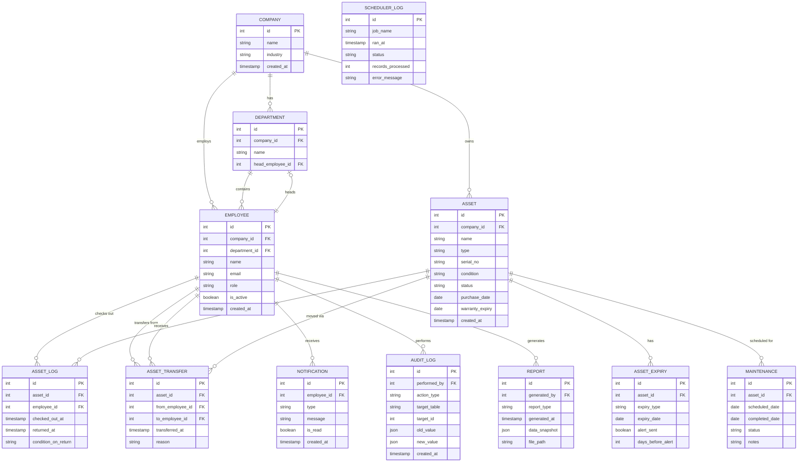

### 📊 Core Database Architecture (ERD)

The entire platform's multi-tenant ecosystem, asset lifecycle tracking, and auditing mechanics are driven by the relational schema mapped below:

```mermaid
erDiagram
  COMPANY {
    int id PK
    string name
    string industry
    timestamp created_at
  }
  DEPARTMENT {
    int id PK
    int company_id FK
    string name
    int head_employee_id FK
  }
  EMPLOYEE {
    int id PK
    int company_id FK
    int department_id FK
    string name
    string email
    string role
    boolean is_active
    timestamp created_at
  }
  ASSET {
    int id PK
    int company_id FK
    string name
    string type
    string serial_no
    string condition
    string status
    date purchase_date
    date warranty_expiry
    timestamp created_at
  }
  ASSET_LOG {
    int id PK
    int asset_id FK
    int employee_id FK
    timestamp checked_out_at
    timestamp returned_at
    string condition_on_return
  }
  ASSET_EXPIRY {
    int id PK
    int asset_id FK
    string expiry_type
    date expiry_date
    boolean alert_sent
    int days_before_alert
  }
  ASSET_TRANSFER {
    int id PK
    int asset_id FK
    int from_employee_id FK
    int to_employee_id FK
    timestamp transferred_at
    string reason
  }
  MAINTENANCE {
    int id PK
    int asset_id FK
    date scheduled_date
    date completed_date
    string status
    string notes
  }
  NOTIFICATION {
    int id PK
    int employee_id FK
    string type
    string message
    boolean is_read
    timestamp created_at
  }
  AUDIT_LOG {
    int id PK
    int performed_by FK
    string action_type
    string target_table
    int target_id
    json old_value
    json new_value
    timestamp created_at
  }
  REPORT {
    int id PK
    int generated_by FK
    string report_type
    timestamp generated_at
    json data_snapshot
    string file_path
  }
  SCHEDULER_LOG {
    int id PK
    string job_name
    timestamp ran_at
    string status
    int records_processed
    string error_message
  }

  COMPANY ||--o{ DEPARTMENT : "has"
  COMPANY ||--o{ EMPLOYEE : "employs"
  COMPANY ||--o{ ASSET : "owns"
  DEPARTMENT ||--o{ EMPLOYEE : "contains"
  EMPLOYEE ||--o| DEPARTMENT : "heads"
  EMPLOYEE ||--o{ ASSET_LOG : "checks out"
  EMPLOYEE ||--o{ ASSET_TRANSFER : "transfers from"
  EMPLOYEE ||--o{ ASSET_TRANSFER : "receives"
  EMPLOYEE ||--o{ NOTIFICATION : "receives"
  ASSET ||--o{ ASSET_LOG : "tracked by"
  ASSET ||--o{ ASSET_EXPIRY : "has"
  ASSET ||--o{ ASSET_TRANSFER : "moved via"
  ASSET ||--o{ MAINTENANCE : "scheduled for"
  EMPLOYEE ||--o{ AUDIT_LOG : "performs"
  EMPLOYEE ||--o{ REPORT : "generates"
```
